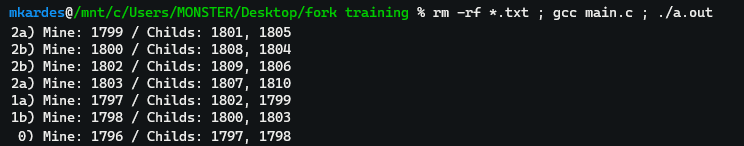
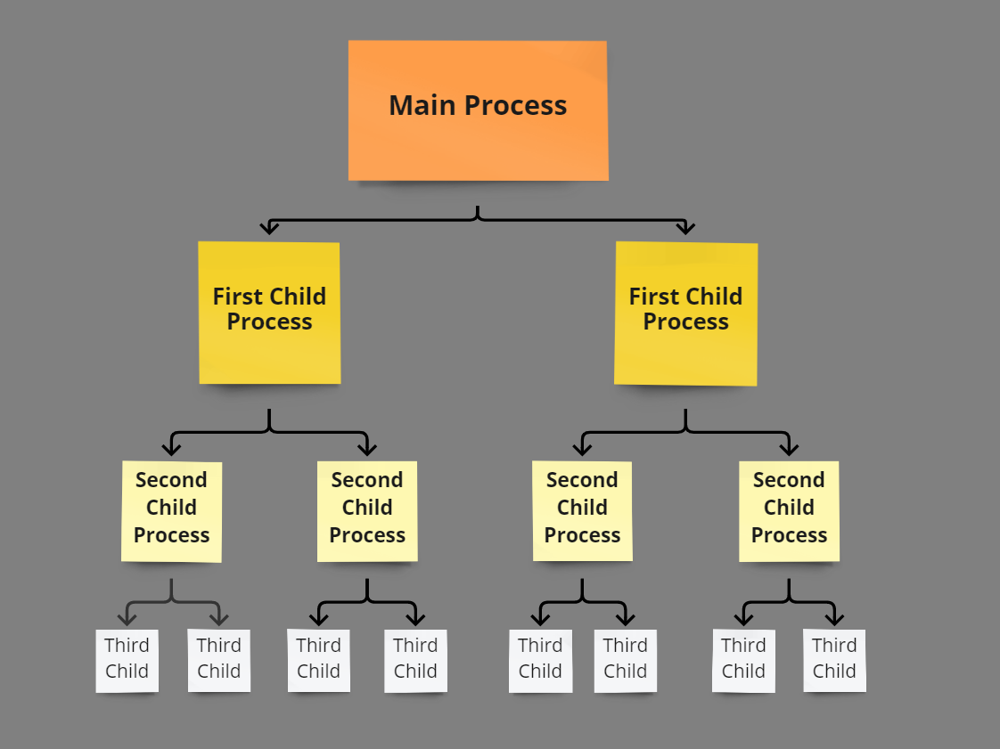

# **Forks in C**

This project's goal is developing on Forks (Multiprocesses). It opens some files as Child and Mother Processes and fills in a different way.

## There are some pictures about this project.


## Fork (Multiprocess)

```c
#include <unsitd.h>

pid_t fork(void);
```
The function above is used to create new(child) processes in a process. It does not take any parameter. It **returns** the ***PID*** number of the process which has just created.
Because it is used by the main process the return value could be assigned to the main processes variables. Main process and child process has the same variables but in ***different places in the memory***. So it can be seen as same variable in name, but actualy they are completely different in memory. When that value is assigned to a variable in main process, the main process takes the child's pid and child process takes "0".


### Example:
```c
int main(void) {

  int pid = fork();
  
  if (pid == 0) {
    //child process
  }
  else {
    //main process
    wait(NULL);
  }
  return(0);
}
```
In this example child process enter in the first condition, while the main process waits in the second contion. When child process is done, the main process will also exit from condition. These things are the simple features of Multiprocessers. 


### Let's try an example with two child:
```c
int main(void) {

    int pid1 = fork();
    if (pid1 == 0) {
        // 1st child process
    
    }
    else {
        // main process
        
        int pid2 = fork();
        if (pid2 == 0) {
          // 2nd child process
        
        }
        else {
            //main process
            
            wait(NULL);
    }
    return(0);
}
```
In this example pid1 pid2 variables belong to main process are equal to child processes ***PID*** numbers.

### Projects Description
- It's asked to write a program that creates two child processes and then that child process creates two child processes too. And lastly, these child processes creates two child processes. In other words, after the execution of the program there would be a main processes and it's two childs and these two child's have four childs and lastly these four child processes have eight childs. 
To draw it out:

